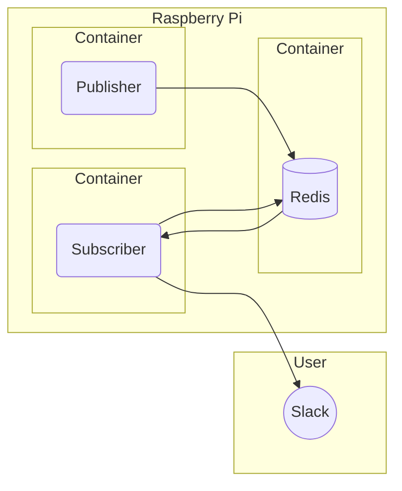

# Redis Pub/Sub Slack Webhook

Redis Pub/Sub 기능을 활용해서 버스 도착 정보를 Slack Webhook으로 보내는 스케줄러입니다. 



## Redis Pub/Sub

실시간 버스 도착 정보들을 처리할 메시징 시스템입니다. 

## Publisher

python apscheduler 모듈을 사용해서 스케줄러를 구현합니다. 공공 데이터를 사용해서 버스 도착 정보를 가지고와 redis 컨테이너에 publish합니다. 

## Subscriber

또 다른 스케줄러가 Publisher에서 만든 채널을 미리 구독 & 대기하고 있습니다. redis로부터 메시지를 받으면, 가공해서 slack webhook url로 post를 합니다. 

## Usage

### docker compose

redis-publisher.env, redis-subscriber.env 파일이 필요합니다. 

```bash
# redis-publisher.env
SERVICE_KEY=''
API_URL=''
STATION_ID=''
BUS_ID=''
BUS_ORDER=''
REDIS_HOST='redis'
```

```bash
# redis-subscriber.env
REDIS_HOST='redis'
SLACK_WEBHOOK_URL=''
```

docker hub에 있는 이미지는 arm64/v8 arch입니다. 

```bash
$ docker-compose up -d
```

### docker 

```bash
# redis
$ docker run --name redis -d redis

# publisher
$ cd publisher
$ docker build -t redis-publisher:test ./
$ docker run -it -d --name redis-publisher \
  -e SERVICE_KEY='' \
  -e API_URL='' \
  -e STATION_ID='' \
  -e BUS_ID='' \
  -e BUS_ORDER='' \
  -e REDIS_HOST='redis' \
  --link redis:redis \
  redis-publisher:test

# subscriber
$ docker build -t redis-subscriber:test ./
$ docker run -it -d --name redis-subscriber \
  -e REDIS_HOST='redis' \
  -e SLACK_WEBHOOK_URL='' \
  --link redis:redis \
  redis-subscriber:test
```
